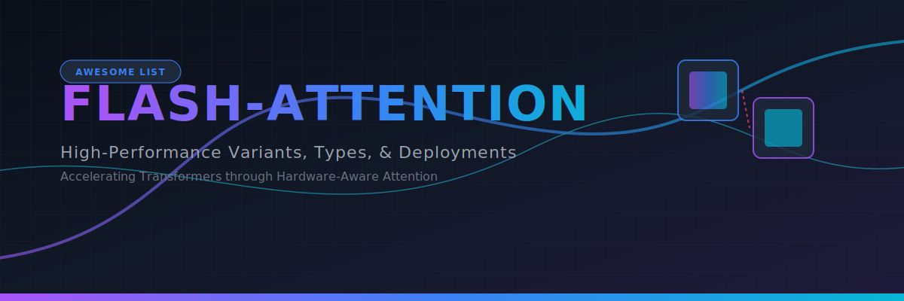

# ⚡ Awesome Flash-Attention ⚡

  

  
  
  
  
  

---

## 📖 Introduction & Technical Overview

**FlashAttention** is a hardware-aware, exact attention algorithm engineered to drastically accelerate Transformer training and inference. 

Standard attention scales quadratically ($O(N^2)$) in memory, bottlenecked by slow High Bandwidth Memory (HBM) read/write operations on GPUs. FlashAttention restructures the computation—using tiling, online softmax, and recomputation—to run entirely within fast on-chip SRAM, cutting memory usage to linear ($O(N)$) and yielding dramatic speedups without any loss in mathematical accuracy.

This curated list tracks the evolution, adaptations, deployments, and production use-cases of the FlashAttention paradigm.

---

## 🚀 1. Algorithmic & Generational Variants

These core versions mark the chronological evolution of FlashAttention, with each generation introducing novel hardware-level scheduling to bypass memory bottlenecks.

| Variant | Mechanism | Significance | First Used (Year) | First Used (Paper) |
| :--- | :--- | :--- | :--- | :--- |
| [**FlashAttention-1 (Tiling & Recomputation)**](details/flashattention_1.md) | Breaks the massive Query, Key, and Value matrices into smaller blocks (tiles). It computes attention block-by-block in SRAM and uses an online softmax trick to incrementally merge block statistics. | Avoids storing the massive $N \times N$ attention matrix in HBM. During the backward pass, it recomputes the softmax scaling factors on-the-fly rather than reading them from memory. | 2022 | [Dao et al., 2022](https://arxiv.org/abs/2205.14135) |
| [**FlashAttention-2 (Work Partitioning Optimization)**](details/flashattention_2.md) | Rearranges the internal loop order and parallelizes computation across the GPU's thread blocks (Stream Multiprocessors) along the sequence length dimension instead of just batch/head dimensions. | Maximizes GPU tensor core utilization (climbing from ~30% to over 70% theoretical peak compute) and halves non-tensor core operations, delivering a $2\times$ speedup over version 1. | 2023 | [Dao, 2023](https://arxiv.org/abs/2307.8691) |
| [**FlashAttention-3 (Asynchronous FP8 Execution)**](details/flashattention_3.md) | Optimized specifically for newer GPU architectures (like NVIDIA H100 Hopper). It leverages specialized hardware features like Tensor Memory Accelerator (TMA) and Asynchronous WGMMA (Warpgroup Matrix Multiply-Accumulate). | Overlaps memory data transfers with raw tensor core calculations. It introduces native, low-precision FP8 quantization support without losing numerical stability, pushing speeds past 1 PetaFLOP. | 2024 | [Dao et al., 2024](https://arxiv.org/abs/2407.02060) |

---

## 🧩 2. Structural & Attention-Type Adapters

These variants modify the baseline FlashAttention algorithm to support specialized attention patterns used across different neural network architectures.

| Adapter | Type | Mechanism | Pros | First Used (Year) | First Used (Paper) |
| :--- | :--- | :--- | :--- | :--- | :--- |
| [**FlashCausalAttention**](details/flashcausalattention.md) | Autoregressive Generation Optimizer. | Tailors the tiling scheduler to skip blocks that fall completely within the upper-triangular region of the attention matrix. | Avoids executing unnecessary mathematical calculations on tokens hidden by causal masking, shaving off nearly 50% of the runtime compute load. | 2022 | [Dao et al., 2022](https://arxiv.org/abs/2205.14135) |
| [**FlashBlockSparseAttention**](details/flashblocksparseattention.md) | Sparse Matrix Optimizer. | Applies a pre-defined block-sparsity mask, restricting memory loads strictly to pre-selected, non-zero query-key tiles. | Allows models to scale to ultra-long context windows (e.g., millions of tokens) by skipping computation for unaligned or distant token blocks. | 2022 | [Dao et al., 2022](https://arxiv.org/abs/2205.14135) |
| [**PagedAttention + FlashAttention Hybrid**](details/pagedattention_hybrid.md) | Production Serving Optimizer. | Combines FlashAttention's kernel execution speed with PagedAttention's non-contiguous virtual memory allocation for Key-Value (KV) caches. | Eliminates structural memory fragmentation during batch LLM serving loops without forfeiting fast SRAM block execution. | 2023 | [Kwon et al., 2023](https://arxiv.org/abs/2309.06180) |

---

## 💻 3. Hardware & Framework Deployments

FlashAttention's logic has been ported across various compiler ecosystems to accelerate diverse deep learning hardware footprints.

| Deployment | Implementation | First Used (Year) | First Used (Paper/Repo) |
| :--- | :--- | :--- | :--- |
| [**PyTorch Native SDPA (Scaled Dot-Product Attention)**](details/pytorch_native_sdpa.md) | Abstracted directly into PyTorch core (`torch.nn.functional.scaled_dot_product_attention`). It automatically dispatches to the FlashAttention kernel behind the scenes if compatible CUDA hardware is detected. | 2023 | [Ansel et al., 2024](https://doi.org/10.1145/3620665.3640366) |
| [**FlashAttention-XLA**](details/flashattention_xla.md) | Adapted for Google TPU hardware clusters. Reinterprets the tiling and fusion logic to fit XLA compiler semantics, allowing JAX and OpenXLA workflows to minimize TPU High Bandwidth Memory overhead. | 2023 | [PyTorch/XLA](https://github.com/pytorch/xla) |
| [**Triton FlashAttention**](details/triton_flashattention.md) | A high-level Python-based implementation written using OpenAI's Triton language. It allows developers to customize block sizes or insert custom head modifications without writing raw, complex CUDA C++ code. | 2022 | [OpenAI Triton](https://github.com/openai/triton) |

---

## 🌟 4. Production Applications

| Application Area | Application | First Used (Year) | First Used (Paper) |
| :--- | :--- | :--- | :--- |
| [**Long-Context Transformer Pre-training**](details/long_context_pretraining.md) | Serves as the critical infrastructure engine that makes modern 128k to 1M+ token context windows feasible during base-model pre-training routines. | 2022 | [Dao et al., 2022](https://arxiv.org/abs/2205.14135) |
| [**High-Throughput Serving Pipelines (vLLM / TensorRT-LLM)**](details/high_throughput_serving.md) | Integrated into commercial inference engines to compress Time-to-First-Token (TTFT) metrics and boost multi-user concurrent query processing speeds. | 2023 | [Kwon et al., 2023](https://arxiv.org/abs/2309.06180) |
| [**High-Resolution Diffusion Networks**](details/high_res_diffusion.md) | Accelerates cross-attention blocks within modern image and video generators (like Sora or Stable Diffusion 3), where processing massive structural patch grids creates intense sequence length pressure. | 2022 | [Dao et al., 2022](https://arxiv.org/abs/2205.14135) |
