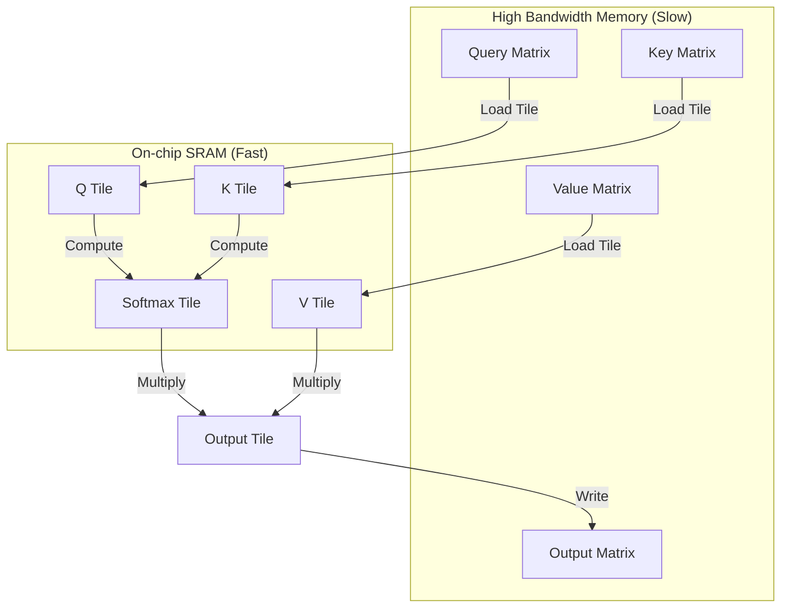

# FlashAttention-1: Tiling & Recomputation

## Overview
FlashAttention-1 is a hardware-aware exact attention algorithm designed to reduce memory read/write overhead on GPUs. Traditional attention mechanisms calculate the intermediate $N \times N$ attention matrix and write it back to the slow High Bandwidth Memory (HBM). FlashAttention-1 avoids this by partitioning the input into blocks, loaded into fast SRAM, computing attention incrementally, and discarding intermediate statistics.

## Core Mechanism
1. **Tiling:** Divides the Query ($Q$), Key ($K$), and Value ($V$) matrices into blocks that fit within GPU SRAM.
2. **Online Softmax:** Standard softmax requires seeing all inputs to find the maximum for numerical stability. FlashAttention uses a running maximum and running sum to scale and merge softmax outputs block-by-block.
3. **Recomputation:** To compute gradients during the backward pass, FlashAttention does not store the $N \times N$ attention matrix. Instead, it recomputes the softmax scaling factors on-the-fly in SRAM.

## Memory Architecture Comparison

## References
- [FlashAttention Paper (arXiv:2205.14135)](https://arxiv.org/abs/2205.14135)

---

[← Back to README](../README.md)
