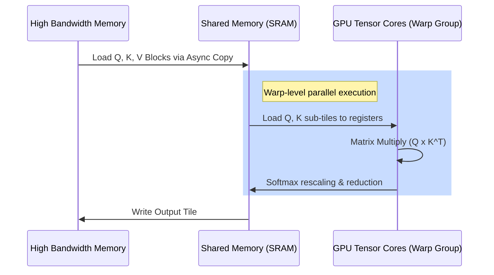

# FlashAttention-2: Work Partitioning Optimization

## Overview
FlashAttention-2 builds upon the original FlashAttention design by improving work partitioning and parallelization across GPU thread blocks. While FlashAttention-1 parallelizes only over batch and head dimensions, FlashAttention-2 parallelizes along the sequence length dimension, allowing for much higher utilization of modern GPU Tensor Cores.

## Core Mechanism
1. **Parallelization over Sequence Length:** Computes block attention in parallel across thread blocks along the Query sequence length dimension.
2. **Reduced Non-Tensor Core Operations:** Optimizes the division of work between Tensor Cores (which do matrix multiplication) and general-purpose GPU cores (which do rescaling and softmax calculations).
3. **Warp-Level Scheduling:** Reorganizes how warps within a thread block collaborate to load data from shared memory (SRAM) to registers, reducing synchronization overhead.

## Warp-Level Execution Flow

## References
- [FlashAttention-2 Paper (arXiv:2307.08691)](https://arxiv.org/abs/2307.08691)

---

[← Back to README](../README.md)
