# FlashAttention-3: Asynchronous FP8 Execution

## Overview
FlashAttention-3 is optimized specifically for newer GPU architectures like NVIDIA Hopper (H100). It focuses on overlapping memory copying with computation (asynchrony) and utilizes low-precision FP8 formats to achieve near-petaflop performance without compromising accuracy.

## Core Mechanism
1. **Asynchronous Memory Copy (TMA):** Uses Hopper's Tensor Memory Accelerator (TMA) to bypass thread registers and transfer data directly between global memory (HBM) and shared memory (SRAM) asynchronously.
2. **Warpgroup WGMMA:** Utilizes hardware-native Warpgroup Matrix Multiply-Accumulate operations, which execute matrix multiplication directly on shared memory buffers.
3. **Overlapping Computation and Memory (Ping-Ponging):** While one warpgroup calculates attention on current tiles in registers, another warpgroup loads the next tiles in the background.
4. **FP8 Quantization:** Supports native FP8 attention with customized scale factors to prevent underflow/overflow during softmax computation.

## Pipeline Diagram

```mermaid
gantt
    title FlashAttention-3 Asynchronous Pipeline (Overlapping)
    dateFormat  X
    axisFormat %s
    section Memory Transfer (TMA)
    Load Tile 1           :active, t1, 0, 5
    Load Tile 2           :active, t2, 5, 10
    Load Tile 3           :active, t3, 10, 15
    section Computation (WGMMA)
    Compute Tile 1        :crit, c1, 5, 10
    Compute Tile 2        :crit, c2, 10, 15
    Compute Tile 3        :crit, c3, 15, 20
```

## References
- [FlashAttention-3 Paper (arXiv:2407.02060)](https://arxiv.org/abs/2407.02060)

---

[← Back to README](../README.md)
