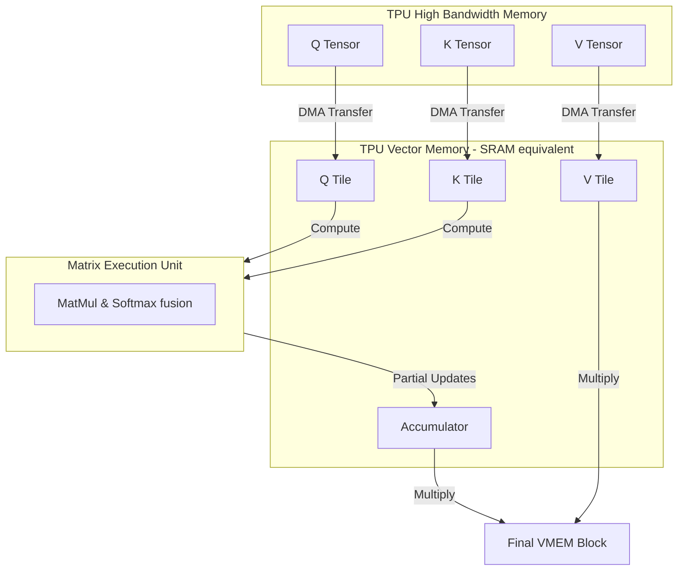

# FlashAttention-XLA

## Overview
FlashAttention-XLA is the adaptation of the FlashAttention algorithm for Google's Accelerated Linear Algebra (XLA) compiler, primarily targeted at Google TPUs (Tensor Processing Units) and JAX/PyTorch-XLA workflows. It translates the GPU-oriented memory tiling and fusion patterns to match XLA compilation paradigms and TPU memory structures.

## Core Mechanism
1. **Pallas Kernels:** Written using JAX's Pallas, a kernel language that allows developers to write custom TPU/GPU kernels directly in Python.
2. **TPU Memory Hierarchy:** TPUs use Vector Memory (VMEM) and Scalar Memory (SMEM) along with High Bandwidth Memory (HBM). FlashAttention-XLA maps Query/Key/Value tiles directly into VMEM.
3. **Loop Fusion:** Instructs the XLA compiler to keep intermediate attention tensors within VMEM/SRAM loops, avoiding compilation rewrites that push tensors back to HBM.

## TPU Execution Flow

## References
- [PyTorch/XLA Github Repository](https://github.com/pytorch/xla)
- [JAX Pallas Documentation](https://github.com/google/jax)

---

[← Back to README](../README.md)
