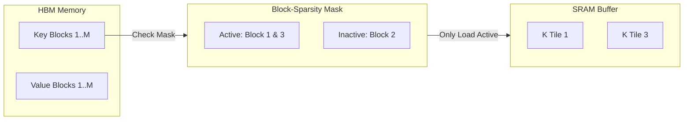

# FlashBlockSparseAttention: Block-Sparse Matrix Optimization

## Overview
FlashBlockSparseAttention is a sparse variant of FlashAttention that limits computation and memory overhead to pre-defined block-sparse structures. Instead of calculating attention across all query-key pairs, it utilizes a block-sparsity mask, skipping tiles that are marked as zero.

## Core Mechanism
1. **Block Sparsity Mask:** A binary matrix indicating which $16 \times 16$ or $64 \times 64$ blocks of the attention matrix are non-zero.
2. **Selective SRAM Loading:** The GPU only loads key-value tiles from HBM into SRAM if the corresponding block in the sparsity mask is active (non-zero).
3. **Sequence Length Scaling:** By reducing the number of blocks to process, it changes the theoretical runtime from quadratic $O(N^2)$ to linear or sub-quadratic depending on the sparsity pattern (e.g., local, strided, or block-diagonal).

## Sparsity Loading Diagram

## References
- [FlashAttention Paper (arXiv:2205.14135)](https://arxiv.org/abs/2205.14135)

---

[← Back to README](../README.md)
