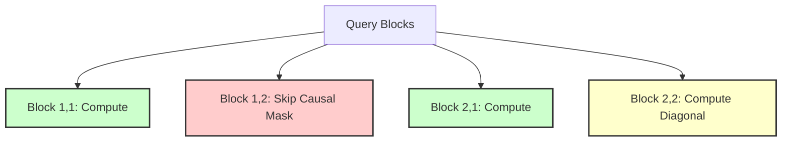

# FlashCausalAttention: Autoregressive Mask Skipping

## Overview
FlashCausalAttention is a structural adapter of the standard FlashAttention algorithm designed for autoregressive language modeling (such as GPT-style decoders). In causal language modeling, tokens can only attend to previous tokens, meaning the attention matrix is lower-triangular. FlashCausalAttention optimizes execution by skipping the computation of tiles that fall entirely within the upper-triangular masked region.

## Core Mechanism
1. **Block Skipping:** If a block in the attention matrix falls completely in the upper-triangular region (where key indices are strictly greater than query indices), the kernel skips loading and calculating it entirely.
2. **Partial Tile Computation:** For blocks intersecting the diagonal (where causal mask cuts through), it computes only the lower-triangular portion of the attention weights.
3. **Compute Savings:** Since nearly half of the $N \times N$ attention matrix is masked out in causal settings, this optimization cuts computation by almost 50%.

## Causal Tile Masking Grid
```mermaid
grid-layout
  [Compute] [Skip]    [Skip]
  [Compute] [Compute] [Skip]
  [Compute] [Compute] [Compute]
```
*(Diagram illustrating a 3x3 block attention matrix where upper-triangular blocks are skipped)*

Alternatively, represented as:



## References
- [FlashAttention Paper (arXiv:2205.14135)](https://arxiv.org/abs/2205.14135)


---

[← Back to README](../README.md)
