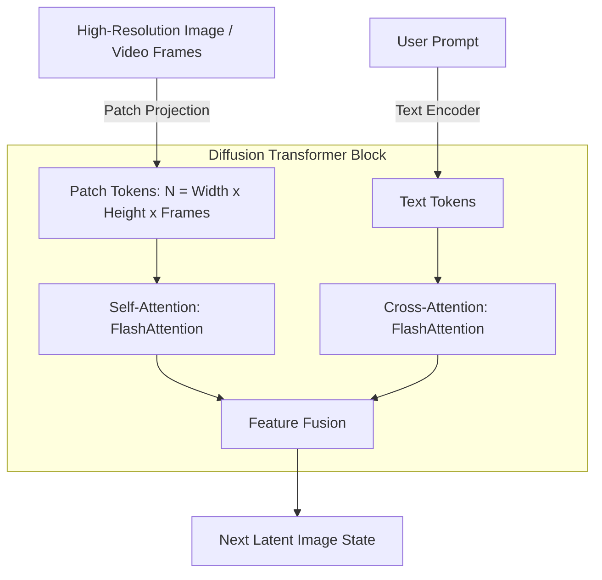

# High-Resolution Diffusion Networks

## Overview
FlashAttention is widely used to accelerate cross-attention and self-attention operations in modern latent diffusion models (such as Stable Diffusion 3, Sora, and Flux). High-resolution image and video generation tasks involve processing massive grids of patches, which scales attention sequence lengths dramatically and creates memory bottlenecks.

## Core Impact in Diffusion
1. **Patch-based Sequences:** In models like Stable Diffusion 3, images are split into patches that act as tokens. A high-resolution image creates thousands of patch tokens, making quadratic scaling of standard attention unusable.
2. **Video Sequence Pressures:** Video models generate multiple frames, multiplying the token counts across the temporal dimension. FlashAttention is required to run video generation without running out of GPU memory.
3. **Cross-Attention Acceleration:** Speeds up text-conditioning (aligning user prompts to image generation) by accelerating cross-attention computations between text embeddings and image patches.

## Diffusion Patch Attention Flow

## References
- [FlashAttention Paper (arXiv:2205.14135)](https://arxiv.org/abs/2205.14135)

---

[← Back to README](../README.md)
