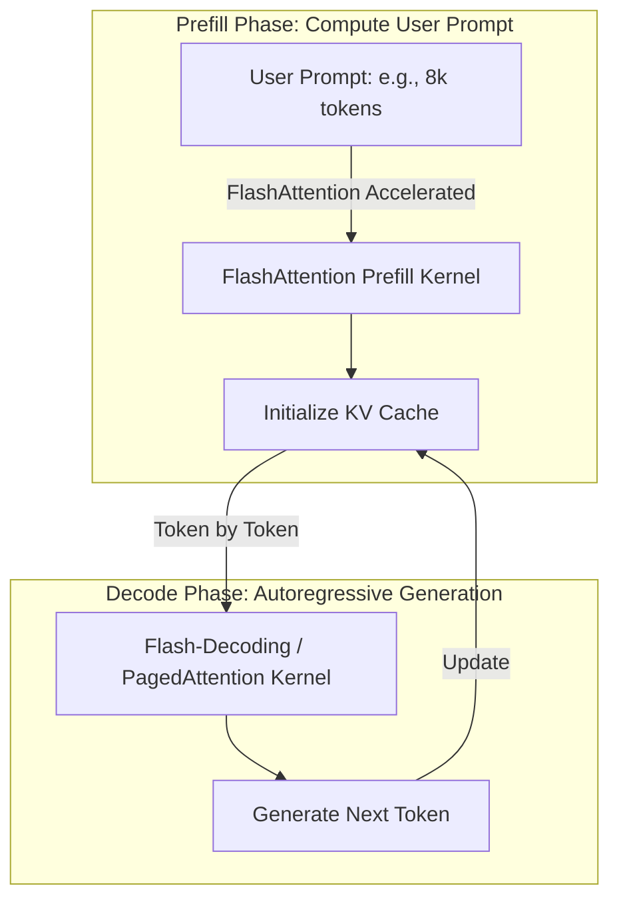

# High-Throughput Serving Pipelines (vLLM / TensorRT-LLM)

## Overview
During inference (serving), FlashAttention is integrated with modern serving engines (like vLLM, Hugging Face TGI, and NVIDIA TensorRT-LLM) to maximize request throughput and reduce latency, specifically optimizing the Time-to-First-Token (TTFT) and generation phases.

## Core Mechanisms in Serving
1. **Prefill Phase Acceleration:** When a user sends a long prompt, the system must process the context (prefill phase). Since prompt length is high, FlashAttention accelerates the prefill phase by avoiding HBM bottlenecks.
2. **Chunked Prefills:** Breaking long user prompts into chunks and executing them using FlashAttention blocks to maintain uniform iteration times.
3. **KV Cache Compression:** Integrations with lower-precision FP8 or FP4 execution to serve more concurrent users on a single GPU.

## Prefill vs Decode Execution Pipeline

## References
- [vLLM / PagedAttention Paper (arXiv:2309.06180)](https://arxiv.org/abs/2309.06180)

---

[← Back to README](../README.md)
