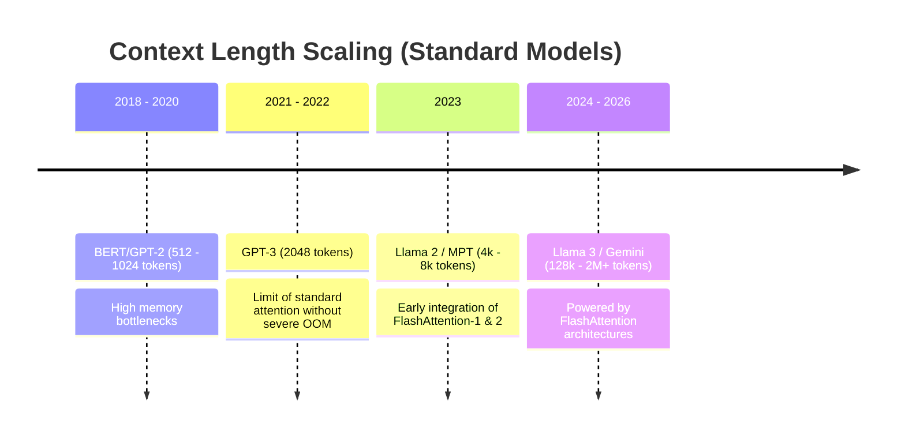

# Long-Context Transformer Pre-training

## Overview
FlashAttention is the key technology enabling LLM context windows to scale from standard 2k tokens to 128k, 1M, or more. By reducing memory overhead from quadratic $O(N^2)$ to linear $O(N)$ with respect to sequence length, models can process long documents, books, and code repositories during pre-training.

## Core Impact
1. **Memory Compression:** Avoids Out-Of-Memory (OOM) errors during the intermediate attention computation step.
2. **Pre-training Efficiency:** Allows training runs on massive GPU clusters to finish significantly faster, saving compute costs.
3. **Multi-Query / Grouped-Query Attention Support:** Pairs with structural variants to scale context length even further during pre-training.

## Context Length Growth Timeline

## References
- [FlashAttention Paper (arXiv:2205.14135)](https://arxiv.org/abs/2205.14135)

---

[← Back to README](../README.md)
