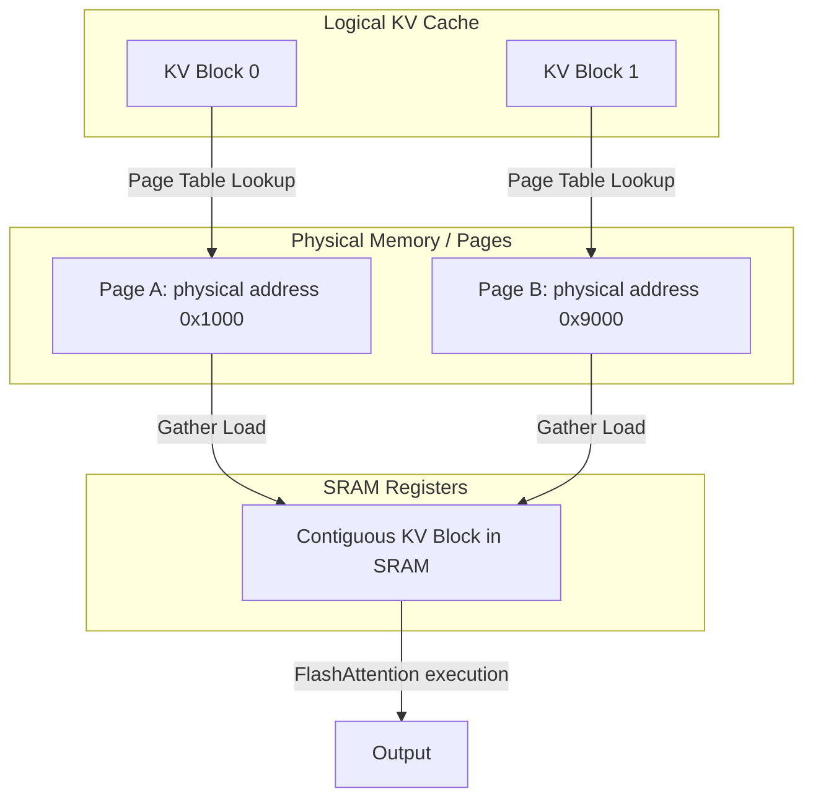

# PagedAttention + FlashAttention Hybrid

## Overview
The PagedAttention + FlashAttention Hybrid combines two critical performance improvements for LLM inference: FlashAttention's fast kernel execution using SRAM and PagedAttention's virtual-memory-like paging for key-value (KV) caches. This solves physical memory fragmentation issues in serving environments without losing hardware acceleration.

## Core Mechanism
1. **Virtual KV Cache Blocks:** PagedAttention divides the KV cache into fixed-size blocks (like pages in operating systems) and allocates them in non-contiguous physical memory.
2. **Scatter-Gather Attention Kernel:** While standard FlashAttention assumes contiguously stored keys and values in memory, the hybrid kernel gathers the KV blocks from different memory pages on-the-fly and loads them into contiguous SRAM registers.
3. **No Fragmentation:** Bypasses memory overallocation and fragmentation, letting batches scale to maximum throughput.

## Paged Scatter-Gather Attention Flow

## References
- [vLLM / PagedAttention Paper (arXiv:2309.06180)](https://arxiv.org/abs/2309.06180)

---

[← Back to README](../README.md)
