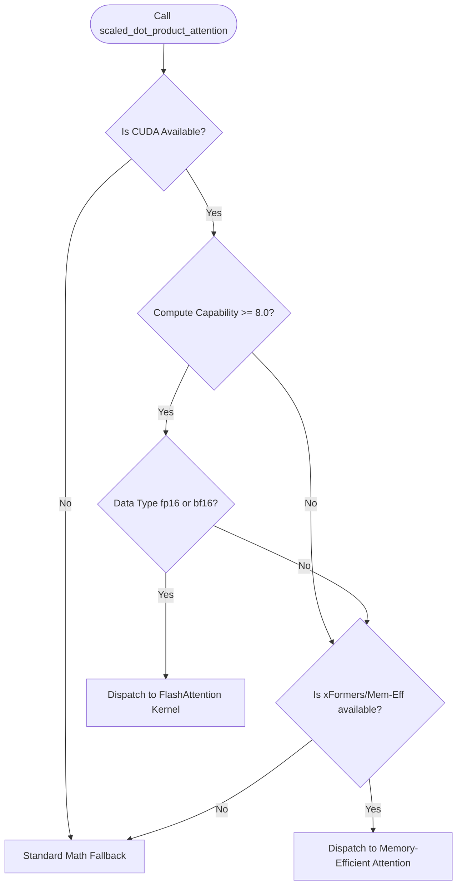

# PyTorch Native SDPA (Scaled Dot-Product Attention)

## Overview
PyTorch Scaled Dot-Product Attention (SDPA) is a native operator introduced in PyTorch 2.0 (`torch.nn.functional.scaled_dot_product_attention`). It acts as a wrapper that automatically dispatches to the most optimal underlying attention implementation (such as FlashAttention, Memory-Efficient Attention, or basic math fallback) based on the inputs and hardware.

## Core Mechanism
1. **Automatic Dispatch:** Analyzes hardware capabilities (e.g., CUDA compute capability), tensor dimensions, data types, and masking configurations.
2. **FlashAttention Path:** If the hardware supports it (NVIDIA Ampere/Hopper/etc. with fp16/bf16 data types), it dispatches the operation directly to custom compiled FlashAttention kernels.
3. **Seamless Fallback:** If requirements for FlashAttention are not met, it falls back to Mem-Efficient Attention (xFormers) or standard PyTorch eager calculations, protecting code execution from crashing.

## Dispatch Decision Tree

## References
- [PyTorch 2.0 Paper (ASPLOS '24)](https://doi.org/10.1145/3620665.3640366)
- [PyTorch SDPA Documentation](https://pytorch.org/docs/stable/generated/torch.nn.functional.scaled_dot_product_attention.html)

---

[← Back to README](../README.md)
