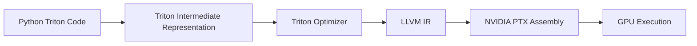

# Triton FlashAttention

## Overview
Triton FlashAttention is a high-performance Python implementation of the FlashAttention algorithm using OpenAI's Triton language. Triton allows developers to write Python code that is compiled into highly optimized GPU kernels, acting as an alternative to raw CUDA C++ and making customized attention variations easier to build.

## Core Mechanism
1. **High-Level Programming Model:** Developers write standard Pythonic loops and block operations. Triton's compiler handles register allocation, scheduling, and memory optimization.
2. **Custom Block Shapes:** Allows researchers to modify block tile sizes (e.g., custom configurations for head dimensions like 96 or 128) without rewrite overhead.
3. **Automatic Shared Memory Management:** Unlike CUDA C++ where shared memory boundaries must be manually managed, the Triton compiler automatically allocates and pools shared memory allocations.

## Triton Compilation Workflow

## References
- [OpenAI Triton Repository](https://github.com/openai/triton)

---

[← Back to README](../README.md)
